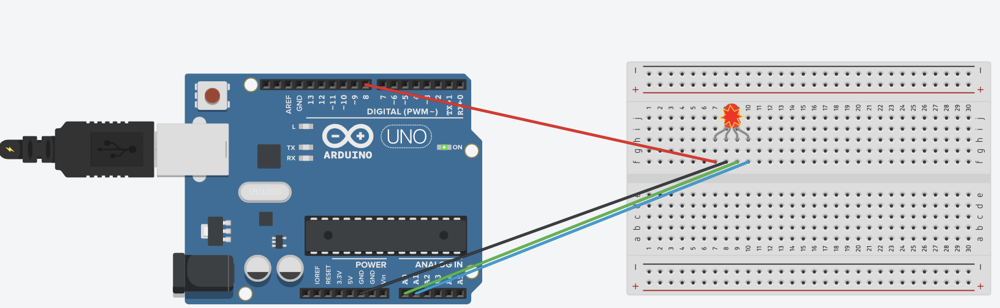
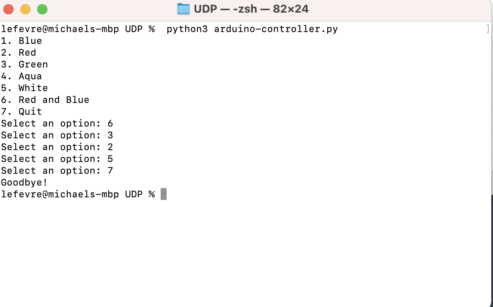
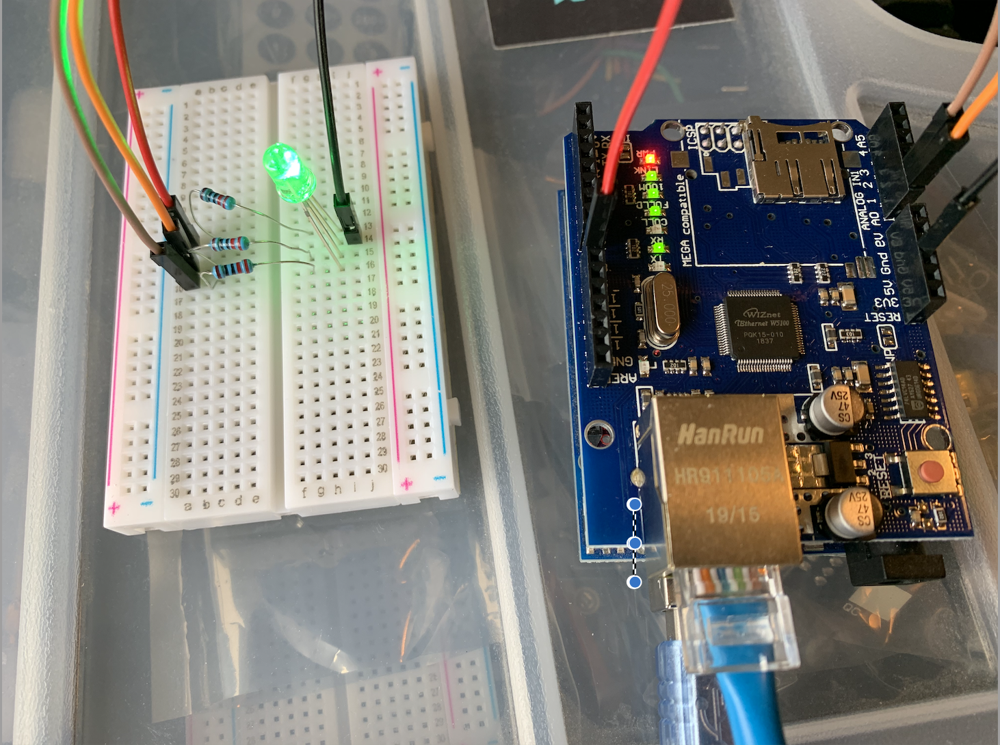

# Arduino-Light-Control
A python script that controls a multi-color LED attached to an Arduino. 
## Overview
I have an Arduino Uno with an ethernet shield attached. The Arduino is running a script that listens to commands sent over UDP to a specified ip and port. I also have a python script that sends the commands. The Arduino will read in the message and change the color of an LED depending on what it has recieved. 

## Setup

Hardware
This was made using a 3rd party Arduino Ethernet Shield V2. Different shields use different pins so you may need to change what pins you are using for the RGB LED. In my case, I used pin 8, A0, and A1. Place the shield on top of the Arduino and connect the LED to the Arduino as diagrammed below. 

Software

Once that is all connected, use the Arduino IED to load the ino file to the Arduino. Change the ip address to match the ip address of your Arduino. Plug the Arduino into power and an ethernet connection. Download the python script to your computer and the change the ip address in the code to match your Arduino's. Navigate to its directory and use the command `python3 arduino_controller` to run the script. 

If you need help finding your Arduino's ip address, run the Dhcp Address Printer Sketch in the Arduino IDE. You will find it under File->Examples->Ethernet->DhcpAddressPrinter.

## Screenshots

## Helpful Websites
[Arduino Ethernet Shield V2 Documentation](https://www.arduino.cc/en/Main/ArduinoEthernetShieldV2)

[Stack Overflow Post](https://stackoverflow.com/questions/18743962/python-send-udp-packet#18746406)

